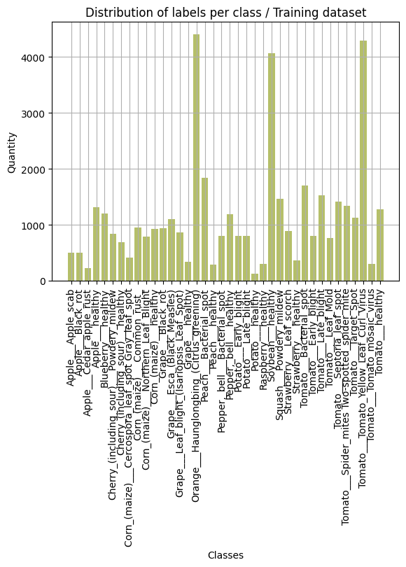

# Project Report: Transfer Learning for Image Classification

## Introduction
Early detection of plant diseases is crucial for healthy crops and better food production. This repository implements a Deep Learning solution to automatically classify 38 different types of plant leaves (including both healthy and diseased samples) using the PlantVillage dataset.

Goal is to compare the performance of two popular CNN models: DenseNet-121 and EfficientNet B0. We explore how well these models learn using two different strategies: training just the classification head versus fine-tuning the model's deeper layers.

## Problem Definition
The goal of this project is to build a Deep Learning model that can correctly identify 38 plant conditions from pictures of single leaves. These plant conditions include 14 types of crops and various diseases. The main problem is telling diseases apart that look very similar and have the texture. The Deep Learning model has to be good at distinguishing between these diseases, with similar visual symptoms and texture patterns of the plant conditions.

To address this, we aim to implement and optimize advanced CNN architectures—DenseNet-121 and EfficientNet B0—to automate the detection process. This solution is designed to make disease diagnosis faster and more accessible, enabling early intervention to significantly decrease crop losses.

## Dataset
For dataset we used PlantVillage from Kaggle.

We faced a problem of imbalanced classes: some classes (like specific Tomato diseases) have thousands of images, while others (like Potato Healthy) may have significantly fewer.

We address this problem during training step.

## Model Architecture
* DenseNet-121

* EfficientNet B0

## Training

We looked at Transfer Learning to make these strong pre-trained models work with the data we have. We tried two ways of training the models:

* **Head-Only Training:** Freezing the main model and training only the final classification layer.

* **Fine-Tuning:** Unfreezing specific layers to refine the model's performance on leaf textures.

## Evaluation
To evaluate our approach appropriately, we analyzed the performance differences between the two training strategies (Head-Only vs. Fine-Tuned) and the two model architectures (DenseNet-121 vs. EfficientNet-B0). Below we will focus on loss and accuracy curves during training and validation.

### Impact of learning strategy

From this graph we can see that the choice of training strategy is very important when it comes to performance.

> Head Loss Curves EfficientNet-B0 and DenseNet-121

Both models shows good performace. The blue line (Training Loss) and orange line (Validation Loss) go down quickly and then flatten out. This means the models are successfully learning to recognize the plant diseases.

Nonetheless, we can also notice that EfficientNet starts a little bit better, since training loss starts with a slightly lower value and converges faster than DenseNet. This aligns with your table results where EfficientNet had slightly higher accuracy.

> Fine-tuned Loss Curves EfficientNet-B0 and DenseNet-121

Both models show excellent performance during the fine-tuning phase. The blue line (Training Loss) and orange line (Validation Loss) continue to decrease significantly, reaching very low values (below 0.03). This confirms that unfreezing the deeper layers allowed the models to learn the finer details of the leaf diseases effectively.

But we can see that EfficientNet demonstrates smoother convergence. While DenseNet (top graph) shows a slight fluctuation around epoch 6 where the validation loss briefly increases, EfficientNet (bottom graph) maintains a very steady decline throughout all epochs. This suggests that EfficientNet was slightly more stable and robust during this final training stage.

> Generalisation gap EfficientNet-B0 and DenseNet-121

The fine-tuning strategy proves to be the best approach for transfer learning because it successfully minimizes the generalization gap to near zero (indicating perfect alignment between training and validation performance), whereas the head-only approach maintains a larger negative disparity where the model underfits the training data relative to the validation set.

### Model comparison

EfficientNet-B0 performed slightly better than DenseNet-121, starting stronger and reaching the highest final accuracy of 99.55%. It also learned more steadily, showing a smooth improvement line during fine-tuning while DenseNet-121 had some disturbance around epoch 6.

### Max Accuracy Comparison

The fine-tuning strategy significantly performed better than head-only approach, boosting validation accuracy from approximately 96% to over 99% for both architectures. For model comparison, EfficientNet-B0 proved to be the best, achieving the highest overall validation accuracy of 99.55% when fine-tuned.

## Conclusions
