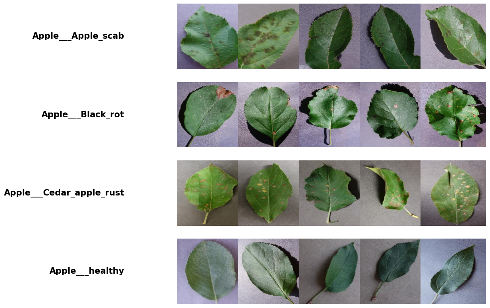
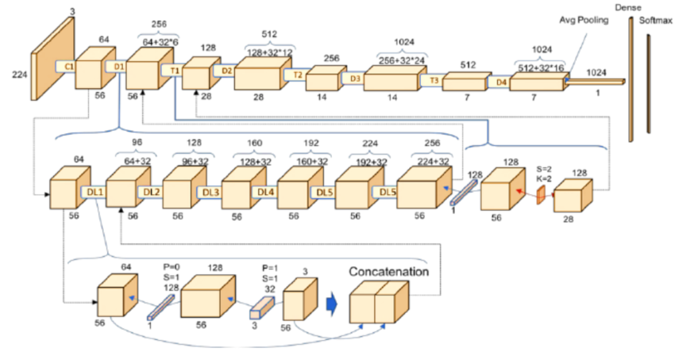
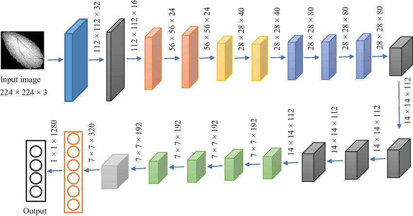
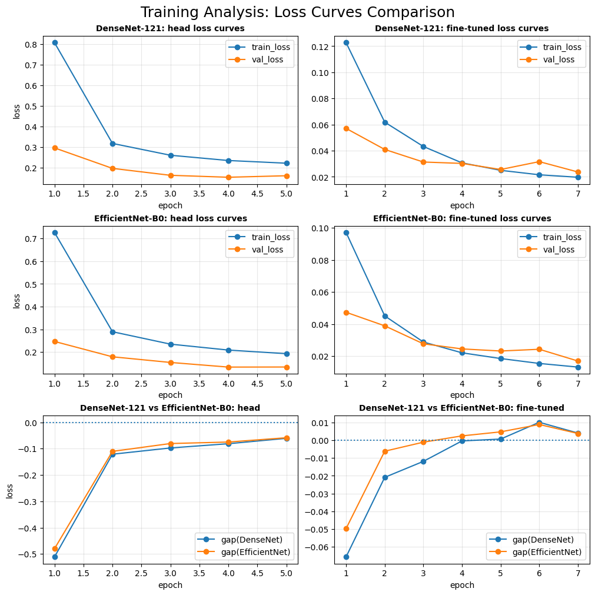
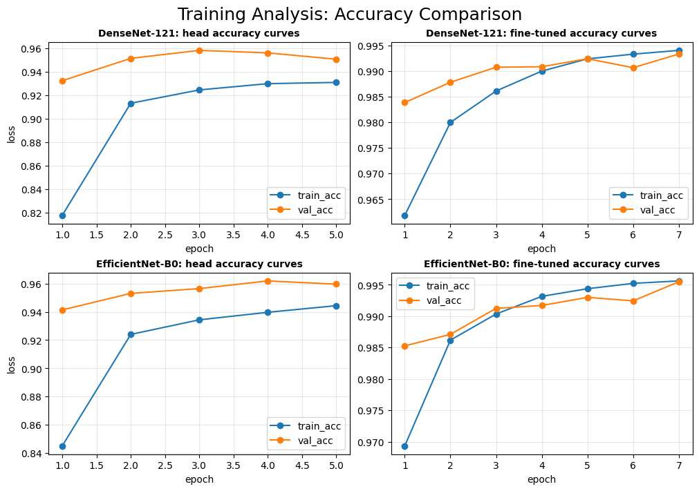
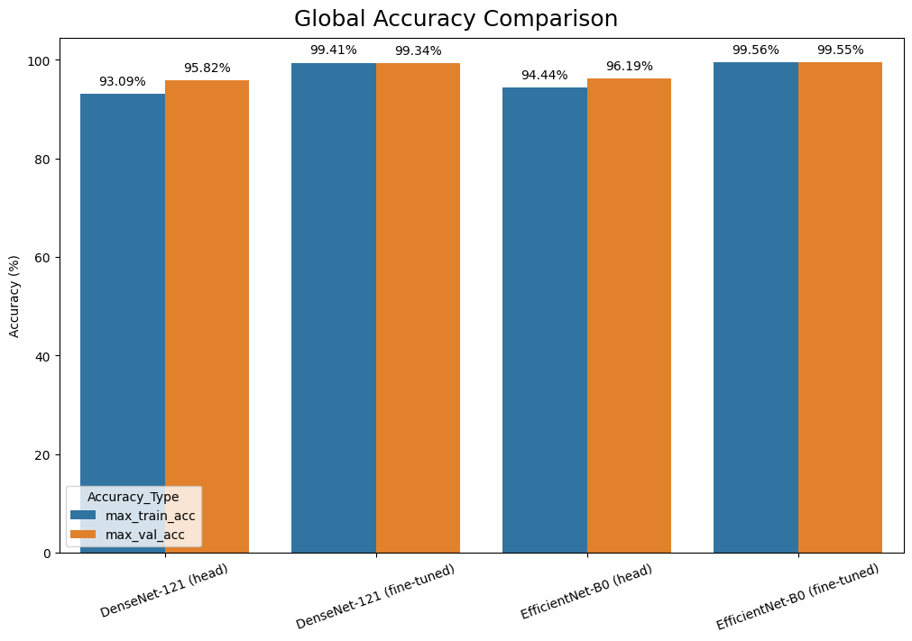
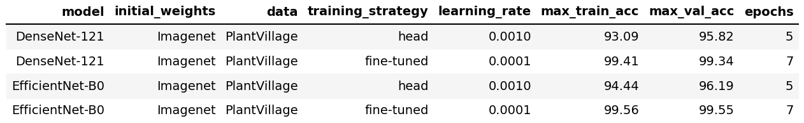

# Project Report: Transfer Learning for Image Classification

## Introduction and Problem Definition

Early detection of plant diseases is essential for maintaining crop health and improving food production. In this project, we implement a deep learning–based image classification system that identifies 38 plant leaf conditions, including healthy and diseased samples, using the PlantVillage dataset. The goal is to evaluate and compare two pretrained CNN architectures, DenseNet-121 and EfficientNet-B0, using transfer learning.

The task is a multi-class classification problem where many disease categories exhibit high visual similarity, especially within the same crop species. This requires the model to capture fine-grained texture and color patterns rather than relying on coarse visual features. To address this challenge, we compare head-only training with fine-tuning of deeper layers, assessing how model adaptation impacts classification performance and generalization.

---

## Dataset

The dataset used in this project is PlantVillage, obtained from Kaggle. It contains 54,305 labeled RGB images with a resolution of 256x256 pixels of single plant leaves captured under relatively controlled conditions. The images cover 14 species of crops (12 of which have healthy leaf images) and 17 basic diseases, 17 basic diseases, 4 bacterial diseases, 2 diseases caused by mold (oomycete), 2 viral diseases and 1 disease caused by a mite. In total the dataset has 38 classes. Below we take a look at a few images from our dataset with their labels:  

An important question is: "How is our data distributed?". It can be answered by observing the tables below:

Test loader:

As we can see, the dataset exhibits class imbalance, where some disease categories (such as several tomato leaf diseases) contain thousands of samples, while others (for example, healthy potato leaves) are represented by significantly fewer images. This imbalance can bias learning toward majority classes and poses an additional challenge for reliable classification, particularly for underrepresented categories.

---

## Model Architecture

### DenseNet-121

DenseNet-121 is a CNN that uses dense connectivity between layers. Each layer receives as input the concatenation of all feature maps from previous layers within the same dense block. This improves gradient flow and promotes feature reuse. The network consists of four dense blocks separated by transition layers. Each layer inside a dense block follows a **Batch Normalization → ReLU → 1×1 Convolution → Batch Normalization → ReLU → 3×3 Convolution** pattern. The 1×1 convolution acts as a bottleneck to reduce computational cost. DenseNet-121 uses a growth rate of 32, meaning each layer adds 32 new feature maps. As layers progress, feature maps accumulate through concatenation, preserving both low-level and high-level information. Between dense blocks, transition layers apply batch normalization, a 1×1 convolution for channel reduction, and 2×2 average pooling for spatial downsampling. This controls model size while maintaining representational capacity. After the final dense block, the network applies global average pooling, followed by a fully connected classification layer with softmax activation. This reduces overfitting and parameter count.

---

### EfficientNet-B0

EfficientNet-B0 uses compound scaling, which jointly scales network depth, width, and input resolution. This balanced scaling achieves high accuracy with fewer parameters and lower computational cost than conventional CNNs. The network is built from repeated MBConv (Mobile Inverted Bottleneck Convolution) blocks, adapted from MobileNetV2. Each MBConv block consists of an optional 1×1 expansion convolution, a depthwise separable convolution (3×3 or 5×5), a Squeeze-and-Excitation (SE) module, and a final 1×1 projection convolution. This structure allows efficient spatial feature extraction while maintaining a compact channel representation. EfficientNet-B0 begins with a 3×3 convolutional stem, followed by seven sequential stages of MBConv blocks. Each stage uses specific kernel sizes, expansion ratios, output channels, and strides. Early stages extract low-level features, while deeper stages capture higher-level semantic information. Residual skip connections are applied when input and output dimensions match, improving gradient flow and training stability. The SE mechanism adaptively reweights feature channels, emphasizing informative features and suppressing less relevant ones. After the final MBConv stage, the network applies global average pooling, followed by a fully connected classification layer with softmax activation. This reduces overfitting and improves generalization.

| EfficientNet-B0: High-level architecture      | EfficientNet-B0: MBConv block structure        |
| --------------------------------------------- | ---------------------------------------------- |
|  |  |

---

## Training  
  
We used transfer learning to adapt ImageNet-pretrained backbones (DenseNet-121 and EfficientNet-B0) to the PlantVillage dataset. For each backbone, we trained in two stages: (1) head-only training to quickly fit a new classifier to the target classes, and (2) fine-tuning of the last backbone block to better capture domain-specific leaf textures and disease patterns.

Training uses **CrossEntropyLoss** and runs on GPU if available (`cuda`), otherwise CPU. During training, inputs and labels are moved to the selected device with `non_blocking=True` for faster transfers.

### Head-Only Training (feature extractor)

In the first stage, the model is initialized with `pretrained=True` and a dropout of `0.2`. The backbone is frozen via `model.train_head_only()`, so only the newly added classification head is updated. This reduces compute cost and stabilizes early training, while leveraging generic ImageNet features.

Optimization for head-only training:
- Optimizer: **Adam**
- Learning rate: **1e-3**
- Weight decay: **1e-4**
- Epochs: **5**

### Fine-Tuning (last block + head)

After head-only training, we reload the best head-only weights and unfreeze only the last backbone block via `model.fine_tune_last_block()`. This allows the network to adapt higher-level features to plant-specific patterns while keeping most pretrained weights fixed to limit overfitting.

Optimization for fine-tuning:
- Optimizer: **Adam**
- Learning rate: **1e-4** (lower for stable fine-tuning)
- Weight decay: **1e-4**
- Epochs: **7**

### Validation, checkpointing, and learning-rate scheduling

After each epoch, we evaluate on the validation set using `eval_phase()` with `torch.no_grad()` to reduce memory usage and speed up evaluation. We track training and validation loss/accuracy per epoch.

We perform checkpointing based on validation accuracy: whenever `val_acc` improves, we save the model weights (`model.state_dict()`) as the current best. At the end of training, the model reloads the best checkpoint before returning.

Learning rate is controlled using `ReduceLROnPlateau`, which monitors validation loss and reduces the learning rate when progress stalls:
- factor = **0.5**
- patience = **2**
- min_lr = **1e-6**

### Saved outputs

For each backbone, we save both training histories and final weights:
- Training history CSVs: `{backbone}_head_history.csv`, `{backbone}_finetune_history.csv`
- Best weights: `{backbone}_best_head.pt`, `{backbone}_best_finetuned.pt`

---

## Evaluation

### Loss Curve Comparison

The graphs below compare training and validation loss for DenseNet-121 and EfficientNet-B0 under head-only training and fine-tuning.

For both networks, head-only training shows a rapid initial loss drop followed by early saturation. Validation loss remains consistently lower than training loss, indicating stable optimization but limited representational adaptation due to frozen feature extractors.

In contrast, fine-tuned models achieve significantly lower final loss values and smoother convergence. The reduced gap between training and validation loss suggests improved generalization and better alignment of learned features with the PlantVillage domain. Minor fluctuations in validation loss toward later epochs indicate the onset of diminishing returns rather than instability.

---

### Global Accuracy Comparison

The following results summarize the maximum achieved training and validation accuracy for each model and training strategy.

Both architectures benefit significantly from fine-tuning, with validation accuracy improving by approximately 3–4 percentage points compared to head-only training. EfficientNet-B0 (fine-tuned) achieves the highest overall validation accuracy, marginally outperforming DenseNet-121 while using a more parameter-efficient design.

Below we can see the small gap between training and validation accuracy across all configurations, which confirms strong generalization and absence of severe overfitting.

---

### Quantitative Performance

This table provides a comparison of both architectures across training strategies, including learning rate, number of epochs, and peak training and validation accuracy.

Both DenseNet-121 and EfficientNet-B0 show a clear performance jump when moving from head-only training to fine-tuning. Head-only training converges quickly within 5 epochs but is limited in maximum achievable accuracy, which shows that frozen backbone features are insufficient for capturing fine-grained plant disease patterns.

Fine-tuning, performed with a lower learning rate and extended training, enables both models to reach near-saturated accuracy above 99% on both training and validation sets. EfficientNet-B0 slightly outperforms DenseNet-121 in terms of validation accuracy while maintaining a more parameter-efficient design.

---

## Conclusions

The results show that while head-only training provides a fast and stable baseline, fine-tuning significantly improves classification accuracy by allowing the models to adapt to domain-specific leaf textures. Fine-tuned models achieved validation accuracies above 99% with minimal generalization gaps, indicating strong learning and limited overfitting.

Between the two architectures, EfficientNet-B0 achieved slightly higher validation accuracy while remaining more computationally efficient. Our results confirm that transfer learning combined with selective fine-tuning is an effective approach for accurate and scalable plant disease detection.

---